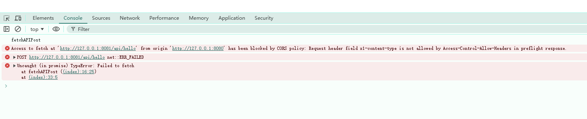
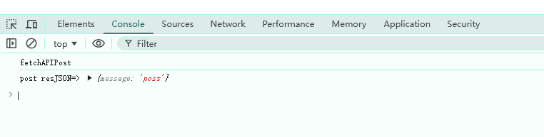

# modern-bff-cors-error

## usage

1. run server

```sh
pnpm run dev
```

open `http://localhost:8081/api/hello` in browser, should return `{"message":"hello"}`.

and cors is enabled with modernJS, see `api/app.js`:

```js
app.use(
  cors({
    origin: '*',
    credentials: false, // 是否允许发送Cookie等凭证信息，若需要跨域携带Cookie，需设置为true
    allowMethods: ['*'],
    allowHeaders: ['*'],
  })
);
```

2. run client

```sh
pnpm run client
```

**cors**
visit `http://127.0.0.1:8080/` and open your browser console, will see cors error.

can not cors access:

```diff
 const res = await fetch('http://127.0.0.1:8081/api/hello', {
       method: 'POST',
       mode: 'cors',
       headers: {
+         'X1-Content-Type': 'application/json',
       },
       body: JSON.stringify({
         a: 'xx',
       }),
     });
```



**Sec-\*filed**

Fake other fields， can cors access：

```diff
 const res = await fetch('http://127.0.0.1:8081/api/hello', {
       method: 'POST',
       mode: 'cors',
       headers: {
+         'Sec-x1': 'application/json',
-         // 'X1-Content-Type': 'application/json',
       },
       body: JSON.stringify({
         a: 'xx',
       }),
     });
```


